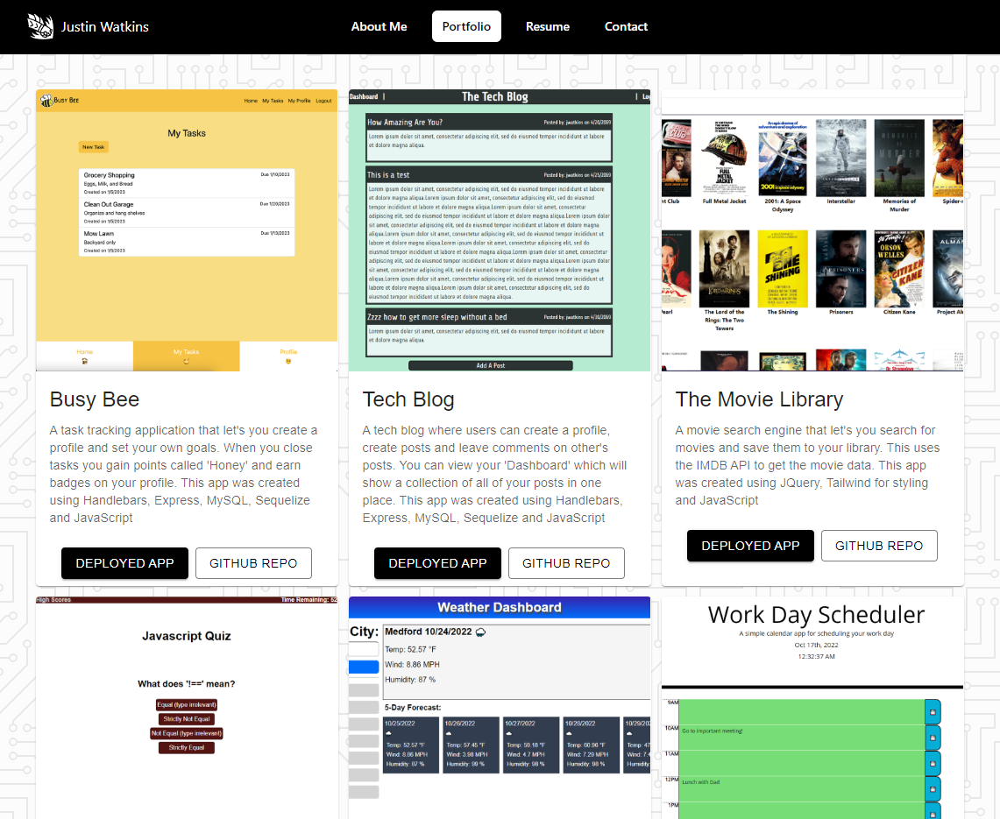

# **Justin Watkins Portfolio**

## **Description**

This app is my personal portfolio showcasing a short bio about myself, a few of my projects, my skillset and resume, and a contact form to reach out to me. This was created using React and a lot of love. There's still a lot I would like to add to this but that will come in the future.

You can access this project here: https://jwatkins28.github.io/Portfolio/

---

## **Table of Contents**

* [Preview](#preview)

* [License](#license)

* [Contributing](#contributing)

* [Questions](#questions)

---

## **Preview**

You can access the portfolio here: https://jwatkins28.github.io/Portfolio/

---

## **License**

This project is licensed under the MIT license.

---

## **Contributing**

If you think anything should be added to this either submit an issue on the repo or reach out to me at my email in the Questions section! 

---

## **Questions**

If you have any questions about the project or repo, contact me directly at justincodingclass@gmail.com or open an issue on the repo. You can find my github profile with this project and others at [github.com/jwatkins28](https://github.com/jwatkins28/)
